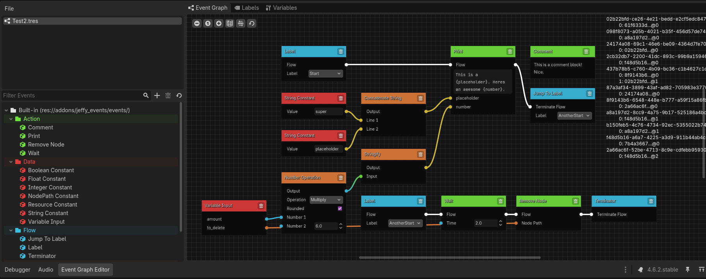

# jeffy-events 2.0 (pre-release)

A graph based event sequencer for Godot 4.6. This addon is a designer friendly solution for game event sequencing, e.g. things like cutscenes and NPC interactions. Sequencing tends to be done through script, or through something like Godot's animation timeline. This is my proposed solution, which tries to strike a balance between minimal code for the programmer and minimal effort required for the designer.

Events are small interfaces; they have one main method, and a few extraneous ones that define how they interact with other nodes and the frontend. GUI is built based on a set of instructions provided by the programmer; it is easily extensible if you want to add new element handlers and instruction sets.

JeffyEvents aims to be unintrusive to existing systems that may exist in your project; as such all classes are namespaced with "JEP_" and the addon only ships with general purpose events. If you want a frame of reference on how events are created, the built in module can serve as a good reference.

## Usage
To use JeffyEvents, just install the addon from the Godot asset library, enable JeffyEvents in *Project Settings > Plugins*, and restart the editor. You will see a graph editor tab added to the bottom dock, which is how you know the addon has been installed correctly. You can view more information about how to use JeffyEvents in the markdown docs.

### Current features
- A stylish graph sequencer frontend with support for flow and data resolution
- Graph and event resource types
- Declarative, extendable gui system for representing event parameters
- Label system which defines starting points for graph execution
- Variable system which allows the programmer to pass in external data to the graph
- Int, float, string, boolean, node path and resource type connections supported
- Graph executor node that performs error checking at editor runtime
- Sources system which lets you define and organize folders to pull event scripts from 

### Planned features
- [ ] Instruction handler registry
- [ ] Clipboard support for graph nodes
- [ ] Custom scene support for graph nodes
- [ ] Nested graph execution
- [ ] Connection stubs (a way of organizing dense connections)
- [ ] Looping

## License
This project is licensed under MPL-2.0. You may use this plugin for anything you want; if modifications are made to core components (not covering user made events,) you must make your changes open-source. Attribution would also be appreciated, but not required. 

This project features external SVG assets which are sourced from Godot itself. [Godot's License](godotengine.org/license)

